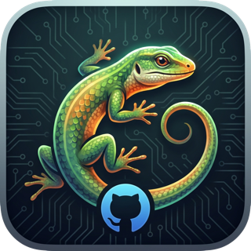
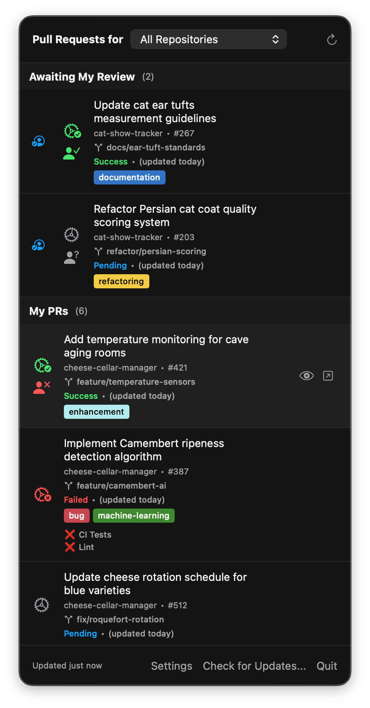

# MonitorLizard



A native macOS menu bar application that monitors your GitHub pull requests and notifies you when builds complete.

Note: this is not production quality code. It's a developer tool, created to meet a very particular need. It's
unrepentently vibe coded, and while I have used it for a week or so and found it pretty handy, I can't warrant
whether it will work for your needs or, indeed, work at all.

Thanks to my team at Doximity for encouragement, support, and some tokens.

## Features

- **Live PR Monitoring**: Displays all your open pull requests with real-time build status
- **Review Requests**: Shows both PRs you authored and PRs awaiting your review (with a special indicator)
- **Auto-Refresh**: Polls GitHub every 30 seconds (configurable 10-300s)
- **Watch PRs**: Mark specific PRs to get notified when their builds finish
- **Inactive Branch Detection**: Highlights PRs that haven't been updated in N days (configurable)
- **Smart Sorting**: Optionally sort non-success PRs to the top of the list
- **Age Indicators**: Shows how long ago each PR was last updated
- **Draft PR Support**: Clearly identifies draft pull requests with a DRAFT badge
- **Native Notifications**: macOS notifications with sound and voice announcements
- **Multi-Repository**: Monitors PRs across all repositories you have access to
- **Build Status Icons** (SF Symbols):
  - ⚙️✓ Success — gear with checkmark (green)
  - ⚙️✗ Failure/Error — gear with xmark (red)
  - ⚙️ Pending — animated spinning gear (gray)
  - ❗ Merge Conflict (purple)
  - ⏳ Inactive (orange)
  - ❓ Unknown (gray)
- **Review Decision Icons**:
  - 👤✓ Approved (green)
  - 👤✗ Changes Requested (red)
  - 👤? Review Required (gray)

  Here's what it looks like in action:

  


## Requirements

- macOS 14.0 (Sonoma) or later
- [GitHub CLI (gh)](https://cli.github.com) installed and authenticated

## Prerequisites

### 1. Install GitHub CLI

MonitorLizard uses `gh` under the covers to fetch PR data.

```bash
brew install gh
```

### 2. Authenticate GitHub CLI

```bash
gh auth login
```

Follow the prompts to authenticate with your GitHub account.

## Installation

### Option A: Download a Release

1. Download the latest `.zip` from the [Releases page](https://github.com/SeanMcTex/MonitorLizard/releases)
2. Unzip and drag `MonitorLizard.app` to your Applications folder
3. Launch the app — it's notarized, so no Gatekeeper warnings
4. The app will appear in your menu bar with a lizard icon
5. Grant notification permissions when prompted

The app checks for updates automatically and will notify you when a new version is available. You can also check manually via **Check for Updates...** in the menu bar.

### Option B: Build from Source

1. Open `MonitorLizard/MonitorLizard.xcodeproj` in Xcode
2. Select your development team under **Signing & Capabilities** if needed
3. Press **⌘R** to build and run
4. The app will appear in your menu bar with a lizard icon
5. Grant notification permissions when prompted

**Note:** The app runs as a menu bar-only application (no Dock icon). Look for the lizard icon in your menu bar.

## Usage

### Basic Operation

1. **Launch**: Click the lizard icon in your menu bar
2. **View PRs**: See all your open pull requests with their build statuses
3. **Refresh**: Click the refresh button or wait for auto-refresh
4. **Open PR**: Click any PR to open it in your browser

### Watching PRs

1. **Start Watching**: Click the eye icon on any PR
2. **Get Notified**: When the build completes, you'll receive:
   - A macOS notification
   - A sound effect (Glass.aiff for success, Basso for failure)
   - Voice announcement: "Build ready for Q A" (for successful builds)
3. **Stop Watching**: Click the eye icon again to unwatch

### Settings

Click **Settings** to configure:

**General:**
- **Refresh Interval**: 10-300 seconds (default: 30s)
- **Sort non-success PRs first**: Show failing/pending/inactive PRs at the top
- **Inactive Branch Detection**: Enable detection and set threshold (1-90 days)

**Notifications:**
- **Show Notifications**: Enable/disable macOS notifications
- **Play Sounds**: Enable/disable sound effects
- **Voice Announcements**: Enable/disable and customize text-to-speech message

## Architecture

The app follows MVVM architecture with SwiftUI:

```
MonitorLizard/
├── Constants.swift      # Centralized constants
├── Models/              # Data models
│   ├── BuildStatus.swift
│   └── PullRequest.swift
├── Services/            # Business logic
│   ├── GitHubService.swift       # gh CLI wrapper
│   ├── ShellExecutor.swift       # Process execution
│   ├── NotificationService.swift # Notifications
│   ├── UpdateService.swift       # Sparkle auto-updates
│   ├── WatchlistService.swift    # Persistent storage
│   └── WindowManager.swift       # Settings window
├── ViewModels/          # State management
│   └── PRMonitorViewModel.swift
└── Views/               # UI components
    ├── MonitorLizardApp.swift
    ├── MenuBarView.swift
    ├── PRRowView.swift
    └── SettingsView.swift
```

### How It Works

1. **Polling**: Timer fires every N seconds (configurable)
2. **Fetch PRs**: Executes two queries:
   - PRs you authored: `gh search prs --author=@me --state=open`
   - PRs awaiting your review: `gh search prs --review-requested=@me --state=open`
   - Both queries fetch: `number,title,repository,url,author,updatedAt,labels,isDraft`
3. **Fetch Status**: For each PR, executes `gh pr view N --json headRefName,statusCheckRollup,mergeable,mergeStateStatus,reviewDecision`
4. **Parse Status**: Determines overall status from individual checks
   - **Priority**: conflict > failure > error > changes requested > pending > inactive > success > unknown
   - **Inactive Detection**: If enabled, marks PRs as inactive when `updatedAt` exceeds threshold
5. **Display**: Shows PRs with status icons, age indicators, labels, and review indicator
6. **Check Completions**: Compares with previous status for watched PRs
7. **Notify**: Sends notifications for completed builds

### GitHub CLI Commands

```bash
# Fetch PRs you authored
gh search prs --author=@me --state=open --json number,title,repository,url,author,updatedAt,labels,isDraft --limit 100

# Fetch PRs awaiting your review
gh search prs --review-requested=@me --state=open --json number,title,repository,url,author,updatedAt,labels,isDraft --limit 100

# Fetch PR details with status and merge state
gh pr view 123 --repo owner/repo --json headRefName,statusCheckRollup,mergeable,mergeStateStatus,reviewDecision

# Check gh CLI authentication
gh auth status
```

## Troubleshooting

### "GitHub CLI is not installed"

Install gh CLI:
```bash
brew install gh
```

### "GitHub CLI is not authenticated"

Authenticate:
```bash
gh auth login
```

### PRs not showing

1. Ensure you have open PRs: `gh pr list --author=@me --state=open`
2. Check gh CLI version: `gh --version` (should be 2.0+)
3. Try manual refresh

### Notifications not appearing

1. Check System Settings > Notifications > MonitorLizard
2. Ensure notifications are enabled in Settings
3. Grant notification permissions when prompted

### Build errors in Xcode

1. Ensure macOS deployment target is 13.0+
2. Check that all Swift files are added to the target
3. Verify Info.plist is configured correctly
4. Clean build folder: **Product > Clean Build Folder** (⇧⌘K)

## Development

### Running Tests

```bash
swift test
```

### Adding Features

The codebase is structured for easy extension:

- **New PR filters**: Modify `GitHubService.fetchAllOpenPRs()`
- **Custom notifications**: Extend `NotificationService`
- **Additional UI**: Add views to `Views/` directory
- **New status types**: Extend `BuildStatus` enum and update priority logic in `GitHubService.parseOverallStatus()`
- **New settings**: Add to `Constants.swift`, create `@AppStorage` properties in `SettingsView`, and wire through to services
- **Time-based features**: Use `Constants.secondsPerDay` for date calculations

## Releasing a New Version

The `scripts/release.sh` script automates the full release process:

```bash
./scripts/release.sh
```

It handles:
1. Updating version numbers in Info.plist
2. Building a Release archive
3. Signing with Developer ID Application certificate
4. Submitting to Apple for notarization
5. Stapling the notarization ticket
6. Signing the zip with Sparkle's EdDSA key
7. Creating a GitHub release with the zip attached
8. Updating `docs/appcast.xml` for Sparkle auto-updates

After the script completes, commit and push so GitHub Pages serves the updated appcast:
```bash
git add MonitorLizard/Info.plist docs/appcast.xml
git commit -m "Release <version>"
git push
```

### Prerequisites for Releasing

- Apple Developer account with Developer ID Application certificate
- Notarization credentials stored via `xcrun notarytool store-credentials`
- Sparkle EdDSA signing key in Keychain (generated by `generate_keys`)
- GitHub CLI (`gh`) installed and authenticated
- GitHub Pages enabled on the repo, serving from `docs/` on `main`

## Credits

Inspired by the original `watch-ci-build` bash script that watched CircleCI builds via GitHub API.

## License

MIT License - feel free to modify and distribute.
